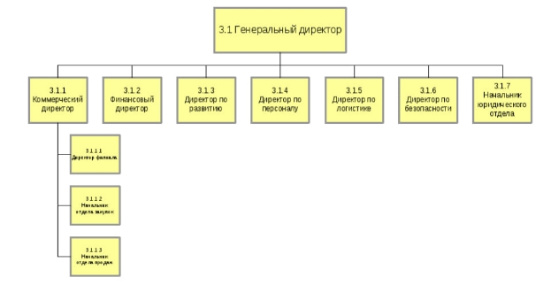

**Выполнение работы**
# **Задание 1.** Предпроектное обследование деятельности компании
Компания занимается оптовой торговлей медикаментов.

В рассматриваемом случае компания планирует закупки, закупает медикаменты, доставляет медикаменты на склад, приходует медикаменты на склад, продает медикаменты.

Организационная структура компании

Бизнес-процессы компании

**1. Управление процессами:**

- Анализ: бизнес-процесс "Управление процессами" направлен на оптимизацию внутренних операций компании. 
- Цель: основной целью этого процесса является повышение эффективности и улучшение качества предоставляемых услуг.
- Шаги: он включает в себя этапы планирования, мониторинга и анализа операций компании.
- Взаимосвязи: процесс "Управление процессами" тесно связан с другими бизнес-процессами, такими как управление закупками и управление качеством, поскольку эффективное управление процессами имеет важное значение для обеспечения высокого качества продуктов или услуг.

**2. Стратегическое управление:**

- Анализ: процесс "Стратегическое управление" является основой для разработки долгосрочных стратегических планов компании.
- Цель: целью является определение путей развития компании, создание конкурентных преимуществ и достижение целей роста.
- Шаги: включает этапы стратегического анализа, формулирования стратегии и мониторинга выполнения планов.
- Взаимосвязи: этот процесс взаимосвязан с бизнес-процессами маркетинга, финансов и операций, так как стратегия влияет на все аспекты компании.

**3. Юридическое обеспечение:**

- Анализ: бизнес-процесс "Юридическое обеспечение" направлен на обеспечение правовой безопасности компании.
- Цель: целью является предотвращение юридических рисков и соблюдение законодательства.
- Шаги: этот процесс включает действия, связанные с заключением договоров, консультированием сотрудников и урегулированием юридических споров.
- Взаимосвязи: юридическое обеспечение может быть связано с процессами закупки, так как заключение контрактов требует юридической экспертизы.

**4. Закупка товара:**

- Анализ: бизнес-процесс "Закупка товара" связан с приобретением товаров и услуг для компании.
- Цель: целью является обеспечение компании необходимыми ресурсами.
- Шаги: он включает этапы поиска поставщиков, оценки предложений и заключения договоров.
- Взаимосвязи: Закупка товаров может влиять на управление складом, так как наличие товаров на складе зависит от эффективной закупки.

**5. Управление закупкой и транспортной логистикой:**

- Анализ: этот процесс связан с управлением закупками и эффективной логистикой товаров.
- Цель: целью является обеспечение наличия необходимых товаров в нужное время и место.
- Шаги: включает планирование закупок, контроль поставок и инвентаризацию.
- Взаимосвязи: этот процесс связан с процессами управления запасами и сбыта, так как планирование закупок и логистики влияет на наличие товаров в магазинах и удовлетворение потребностей клиентов.

6. **Управление маркетингом:**
- Анализ: бизнес-процесс "Управление маркетингом" фокусируется на разработке маркетинговых стратегий, планировании рекламных кампаний и анализе рынка.
- Цель: главной целью этого процесса является привлечение клиентов и продвижение продуктов или услуг компании на рынке.
- Шаги: включают этапы исследования рынка, формирования маркетинговых планов и контроля результатов кампаний.
- Взаимосвязи: процесс управления маркетингом тесно связан с бизнес-процессами продажи и управления брендом, так как маркетинг влияет на спрос и узнаваемость бренда.

6. **Хранение и складирование товара:**
- Анализ: этот бизнес-процесс включает в себя управление складами, контроль качества товаров, их хранение и отгрузку.
- Цель: главной целью этого процесса является обеспечение наличия товаров для удовлетворения потребностей клиентов.
- Шаги: включают в себя прием товаров, их хранение с соблюдением стандартов качества и эффективное управление складскими запасами.
- Взаимосвязи: процесс хранения и складирования товаров тесно связан с бизнес-процессами закупки и отгрузки, так как он влияет на доступность товаров для клиентов.

6. **Обеспечение безопасности:**
- Анализ: этот процесс включает в себя меры по обеспечению физической и информационной безопасности компании.
- Цель: главной целью этого процесса является защита активов компании, данных и обеспечение безопасности персонала и клиентов.
- Шаги: включают в себя установку систем видеонаблюдения, контроль доступа, а также меры по обеспечению информационной безопасности.
- Взаимосвязи: этот процесс может влиять на процессы управления персоналом и административное обеспечение, так как безопасность персонала и данных является критической.

6. **Продажа товара через филиалы:**
- Анализ: этот бизнес-процесс включает в себя прием заказов от филиалов, управление запасами в филиалах, обработку заказов и отчетность.
- Цель: главной целью этого процесса является обеспечение филиалов товарами и услугами для удовлетворения потребностей клиентов в различных локациях.
- Шаги: включают в себя сбор заказов от филиалов, управление запасами в филиалах, обработку заказов, отгрузку и генерацию отчетов о продажах и остатках.
- Взаимосвязи: процесс продажи товаров через филиалы связан с бизнес-процессами управления складами, логистики и маркетинга, так как необходимо обеспечивать филиалы товарами вовремя.

6. ` `**Продажа товара оптом:**
- Анализ: этот бизнес-процесс включает в себя прием и обработку заказов от оптовых клиентов, управление контрактами и отгрузку товаров.
- Цель: главной целью этого процесса является продажа товаров оптовым клиентам и обеспечение их потребностей.
- Шаги: включают в себя прием заказов, управление контрактами с оптовыми клиентами, обработку и отгрузку заказов.
- Взаимосвязи: процесс продажи товара оптом связан с бизнес-процессами управления заказами, контрактами и управления финансами, так как оптовые сделки могут влиять на финансовое состояние компании.

6. **Управление финансами:**
- Анализ: бизнес-процесс управления финансами включает в себя учет финансовых операций, бюджетирование и финансовый анализ.
- Цель: главной целью этого процесса является обеспечение финансовой стабильности и устойчивости компании.
- Шаги: включают в себя учет финансовых операций, составление бюджета, анализ финансовых показателей и отчетность.
- Взаимосвязи: процесс управления финансами тесно связан с бизнес-процессами планирования, контроля затрат и управления рисками.

6. **Административно-хозяйственное обеспечение:**
- Анализ: этот процесс включает в себя административные функции, управление ресурсами и обеспечение бесперебойной работы офиса.
- Цель: главной целью этого процесса является обеспечение эффективного функционирования компании, управление персоналом и ресурсами.
- Шаги: включают в себя управление офисом, обеспечение поставок, управление персоналом и учет документов.
- Взаимосвязи: этот процесс может влиять на множество других бизнес-процессов, так как обеспечивает основы для эффективной работы всей компании.

6. **ИТ-обеспечение и связь:**
- Анализ: этот бизнес-процесс фокусируется на обеспечении ИТ-инфраструктуры компании, управлении сетевой связью, обслуживании компьютеров и технической поддержке.
- Цель: главной целью этого процесса является обеспечение надежной и эффективной работы ИТ-систем, а также связи между сотрудниками и клиентами.
- Шаги: включают в себя установку и обслуживание серверов, сетей, оборудования, а также техническую поддержку сотрудников.
- Взаимосвязи: процесс ИТ-обеспечения и связи сильно взаимосвязан с бизнес-процессами обеспечения безопасности (например, информационной безопасности) и административно-хозяйственным обеспечением (например, управление офисом), так как они зависят от эффективной работы ИТ-систем.

6. **Управление персоналом:**
- Анализ: этот бизнес-процесс включает в себя найм сотрудников, обучение, управление рабочими отношениями, мотивацию и развитие персонала.
- Цель: главной целью этого процесса является создание профессиональной и мотивированной рабочей силы, способной достигать бизнес-целей компании.
- Шаги: включают в себя найм сотрудников, оценку их производительности, организацию обучения, управление конфликтами, мотивацию и карьерное развитие.
- Взаимосвязи: процесс управления персоналом тесно связан с бизнес-процессами обеспечения безопасности (например, охраной персонала), управления маркетингом (например, обучением сотрудников по продажам) и административным обеспечением (например, управлением персоналом и ресурсами). Эффективное управление персоналом важно для успеха всей компании.

# **Задание 2.** Составить организационную диаграмму
Организационная диаграмма / Матрица ответственности

|Оргструктура/ Бизнес-процессы|1\. Генеральный директор|1\.1. Коммерческий директор|1\.2. Финансовый директор|1\.3. Директор по развитию|
1\.4. Директ ор по персоналу

|1\.5. Директ ор по логисти ке|1\.6. Директор по безопасности|1\.7. Начальник юридического отдела|
| :-: | :-: | :-: | :-: | :-: | :-: | :-: | :-: | :-: |
|1. Основные бизнес-процессы|||||||||
|Закупка товара||X|||||||
|Хранение и складирование товара||||||X|||
|Продажа товара через филиалы||X|||||||
|Продажа товара оптом||X|||||||
|2. Обеспечивающие бизнес-процессы|||||||||
|Юридическое обеспечение||||||||X|
|Обеспечение безопасности|||||||X||
|Административно-хозяйственное обеспечение||||||X|||
|ИТ-обеспечение и связь|||||||X||
|3. Бизнес-процессы управления|||||||||
|Управление процессами|X||||||||
|Стратегическое управление|X||||||||
|Управление закупкой и транспортной логистикой||||||X|||
|Управление маркетингом||||X|||||
|Управление финансами|||X||||||
|Управление персоналом|||||X||||

# **Задание 3.** Определение бизнес-процессов для автоматизации:

1. **Продажа товара через филиалы:**
- Анализ: процесс "Продажа товара через филиалы" включает этапы, такие как прием заказов, управление инвентаризацией и генерация отчетов.
- Автоматизация: в этом процессе можно автоматизировать систему управления запасами в филиалах, что позволит автоматически отслеживать остатки товаров и уведомлять филиалы о необходимости пополнения запасов. Также можно внедрить автоматизированную систему генерации отчетов о продажах и остатках товаров для более оперативного анализа.

1. **Продажа товара оптом:**
- Анализ: бизнес-процесс "Продажа товара оптом" включает этапы, связанные с обработкой заказов от оптовых клиентов, управлением контрактами и отгрузкой товаров.
- Автоматизация: можно автоматизировать систему управления заказами оптовых клиентов, что ускорит обработку заказов и уменьшит возможные ошибки. Автоматическое уведомление клиентов о статусе заказов также может быть внедрено. Для управления контрактами можно использовать систему автоматизации контрактов, что упростит процесс заключения и управления контрактами.

1. **Управление финансами:**
- Анализ: бизнес-процесс управления финансами включает в себя учет финансовых транзакций, бюджетирование и финансовый анализ.
- Автоматизация: для автоматизации финансовых процессов, можно использовать программное обеспечение для автоматической записи финансовых транзакций, таких как счета, платежи и доходы. Автоматическое бюджетирование и прогнозирование с использованием специализированных инструментов позволит быстро анализировать финансовые данные и принимать решения на основе актуальных данных. Также можно внедрить систему для автоматической генерации финансовых отчетов и аналитики.

1. **Управление маркетингом:**
- Анализ: бизнес-процесс управления маркетингом включает в себя разработку маркетинговых стратегий, планирование рекламных кампаний, анализ рынка и конкурентов.
- Автоматизация: можно автоматизировать процессы анализа рынка и сбора данных о потребителях с помощью маркетинговых инструментов и аналитики. Также можно использовать автоматизированные системы управления рекламными кампаниями, чтобы оптимизировать расходы и увеличить эффективность маркетинговых усилий.

1. **Хранение и складирование товара:**
- Анализ: этот бизнес-процесс включает в себя управление складами, прием и отгрузку товаров, а также контроль за складскими запасами.
- Автоматизация: можно автоматизировать систему управления складами, используя штрихкоды и сканеры для отслеживания товаров. Автоматические системы учета запасов помогут предотвращать дефициты и избытки.

1. **Обеспечение безопасности:**
- Анализ: этот процесс включает в себя меры по обеспечению физической и информационной безопасности компании.
- Автоматизация: можно автоматизировать системы видеонаблюдения, контроля доступа и мониторинга сетевой безопасности для обеспечения надежной защиты.

1. **Продажа товара через филиалы:**
- Анализ: этот процесс включает в себя прием заказов, управление запасами в филиалах и обработку отчетности о продажах.
- Автоматизация: автоматизация системы управления запасами в филиалах поможет оптимизировать процесс заказов и ускорить доставку товаров. Также, автоматизированные системы отчетности позволят быстро анализировать данные о продажах и остатках.

1. **Продажа товара оптом:**
- Анализ: этот процесс включает в себя обработку заказов оптовых клиентов, управление контрактами и отгрузку товаров.
- Автоматизация: можно внедрить автоматизированную систему управления заказами оптовых клиентов, которая упростит обработку заказов и уведомление клиентов о статусе заказа. Также, система автоматизации контрактов улучшит процесс заключения и управления контрактами.

1. **Управление финансами:**
- Анализ: бизнес-процесс управления финансами включает в себя бухгалтерию, учет финансовых операций и финансовый анализ.
- Автоматизация: можно автоматизировать учет финансовых операций с помощью специализированных программ, что уменьшит вероятность ошибок и ускорит процесс. Автоматизированные системы бюджетирования и анализа данных также помогут сделать финансовое управление более эффективным.

1. **Административно-хозяйственное обеспечение:**
- Анализ: этот процесс включает в себя административные функции, управление ресурсами и управление офисом.
- Автоматизация: можно автоматизировать процессы учета документов, управления ресурсами (как персонал и оборудование) и автоматизировать задачи, связанные с административной работой. Это уменьшит необходимость в ручной обработке данных и повысит производительность.

1. **ИТ-обеспечение и связь:**
- Анализ: бизнес-процесс ИТ-обеспечения и связи включает в себя управление ИТ-инфраструктурой, обеспечение связи и обслуживание компьютерной техники.
- Автоматизация: можно автоматизировать мониторинг и управление ИТ-системами, уведомление о сбоях, а также управление инфраструктурой с помощью специализированных ИТ-решений.

1. **Управление персоналом:**
- Анализ: этот бизнес-процесс включает в себя найм, обучение, управление рабочими отношениями и мотивацию персонала.
- Автоматизация: можно внедрить системы управления рекрутингом и обучением сотрудников. Автоматизированные системы оценки производительности также помогут в управлении персоналом более эффективно.

